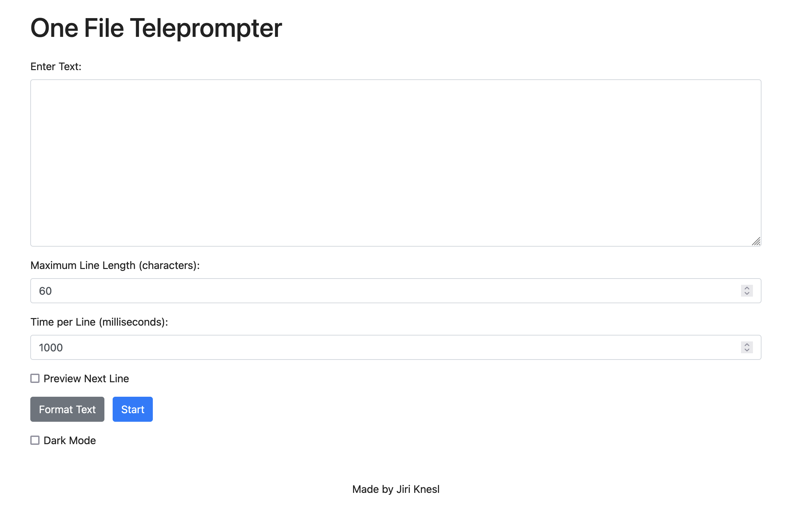

# One File Screen Reader

An easy-to-use, single-file web application for displaying text in a screen-reading format. Designed for presentations, teleprompting, or aiding reading by displaying text line by line with customizable settings.

## Features

- **Single HTML File**: No need for complex setups or installations. Just open the file in your browser.
- **Customizable Display**:
  - Set maximum line length to control text wrapping.
  - Adjust time per line for automatic progression.
  - Toggle dark mode for comfortable reading in different lighting conditions.
- **Preview Next Line**: Optionally display the upcoming line to improve reading flow.
- **Responsive Design**: Optimized for desktops, tablets, and mobile devices.
- **Touch and Keyboard Controls**:
  - Swipe gestures for navigating between lines on touch devices.
  - Keyboard shortcuts for quick control:
    - Spacebar: Pause/Resume.
    - Left/Right Arrow Keys: Previous/Next Line.
- **Control Buttons**: On-screen buttons for pause/resume, previous, and next lines, ideal for devices without keyboards.
- **Persistent Settings**: Dark mode preference is saved across sessions.
- **Animations**: Smooth transitions between lines for an enhanced reading experience.

## Getting Started

### Prerequisites

- A modern web browser (e.g., Chrome, Firefox, Safari, Edge) with JavaScript enabled.

### Installation

1. **Download the HTML File**:

   - Save the provided `index.html` file to your computer or device.

2. **Open the File**:

   - **Desktop**: Double-click the `index.html` file to open it in your default web browser.
   - **Mobile Devices**: Transfer the file to your device and open it using a compatible browser, or host it on a local or remote web server and access it via URL.

## Usage

1. **Enter Your Text**:

   - Paste or type your text into the "Enter Text" textarea.

2. **Set Maximum Line Length**:

   - Specify the maximum number of characters per line. This controls how the text will wrap.

3. **Set Time Per Line**:

   - Enter the duration (in milliseconds) that each line will be displayed before automatically advancing.

4. **Format Text**:

   - Click the **"Format Text"** button to adjust the text according to the maximum line length.

5. **Preview Next Line** (Optional):

   - Check the **"Preview Next Line"** option to display the upcoming line during the reading session.

6. **Toggle Dark Mode** (Optional):

   - Use the **"Dark Mode"** checkbox to switch between light and dark themes. Your preference will be saved for future sessions.

7. **Start Reading**:

   - Click the **"Start"** button to begin the reading session.

8. **Control the Reading Session**:

   - **Pause/Resume**:
     - Click the **"Pause/Resume"** button, or press the **spacebar**.
   - **Navigate Between Lines**:
     - Use the **"<<"/">>"** buttons, **left/right arrow keys**, or **swipe gestures** (swipe left/right) on touch devices.
   - **Stop Reading**:
     - Click the **"Stop"** button to end the session and return to the input form.

## Controls Summary

- **Spacebar**: Pause or resume the automatic progression.
- **Left Arrow Key**: Go to the previous line.
- **Right Arrow Key**: Advance to the next line.
- **Swipe Left**: Advance to the next line (on touch devices).
- **Swipe Right**: Go to the previous line (on touch devices).

## Customization

Feel free to modify the `index.html` file to suit your needs. You can adjust styles, animations, or add new features using HTML, CSS, and JavaScript.

## Compatibility

Tested on the latest versions of:

- Chrome
- Firefox
- Safari
- Edge

Some features may have limited support on older browsers or devices.

## License

This project is licensed under the MIT License.

## Acknowledgments

- **Alpine.js**: A lightweight JavaScript framework used for reactive components.
- **Bootstrap**: CSS framework for styling and responsive design.

## Author

Made by [Jiri Knesl](https://github.com/jiriknesl/screen-reader)

## Contributing

Contributions are welcome! Feel free to submit a pull request or open an issue for suggestions and improvements.

## Contact

For questions or support, please open an issue on the [GitHub repository](https://github.com/jiriknesl/screen-reader).